# BAB IV — ANALISIS SISTEM BERBASIS DATABASE `sidapeta_sby`

**Sumber data:** `sidapeta_sby (1).sql` (MariaDB 10.4.32, phpMyAdmin dump, 22 Mei 2026)  
**Nama database:** `sidapeta_sby`  
**Jumlah tabel:** 39 tabel  
**Relasi formal (FOREIGN KEY):** 1 constraint (`custom_layers` → `users`)

---

## RINGKASAN STRUKTUR DATABASE

### Daftar Tabel, Primary Key, dan Fungsi

| No | Tabel | Primary Key | Fungsi Utama |
|----|-------|-------------|--------------|
| 1 | `users` | `id` | Autentikasi pengguna aplikasi |
| 2 | `sessions` | `id` | Sesi login Laravel |
| 3 | `password_reset_tokens` | `email` | Token reset password |
| 4 | `custom_layers` | `id` | Metadata layer peta kustom per pengguna |
| 5 | `geo_layers` | `id` | Fitur spasial (GeoJSON) layer baku sistem |
| 6 | `demografi_rw` | `id` | Demografi KK/jiwa per RW |
| 7 | `data_sampah` | `id` | Agregat volume sampah per wilayah |
| 8 | `data_kualitas_lingkungan` | `id` | Hasil uji kualitas lingkungan (parameter) |
| 9 | `master_bank_sampah` | `id` | Master bank sampah & tonase |
| 10 | `master_fasilitas_rinci` | `id` | Master TPS/fasilitas persampahan |
| 11 | `master_armada` | `id` | Master armada pengangkutan |
| 12 | `laporan_tps3r_harian` | `id` | Laporan harian TPS3R |
| 13 | `laporan_tpa_rekap` | `id` | Rekap tonase TPA per tahun |
| 14 | `laporan_bbm` | `id` | Konsumsi BBM operasional per bulan |
| 15 | `laporan_b3_rt` | `id` | Limbah B3 di fasilitas RT/TPS3R |
| 16 | `kebutuhan_bbm_kendaraan_operasionals` | `id` | Kebutuhan BBM kendaraan |
| 17 | `kebutuhan_bbm_peralatan_operasionals` | `id` | Kebutuhan BBM peralatan |
| 18 | `kompos_lokasi` | `no` | Produksi kompos per lokasi |
| 19 | `ringkasan_rth_kotas` | `id` | Ringkasan luas RTH kota |
| 20 | `persentase_tipologis` | `id` | Bobot tipologi RTH (A/B/C) |
| 21 | `luasan_rth_dprkpps` | `id` | Detail luasan RTH per zona DPRKPP |
| 22 | `rekapitulasi_rth_tamans` | `id` | Rekap taman per wilayah kota |
| 23 | `rekapitulasi_rth_makams` | `id` | Rekap luas pemakaman sebagai RTH |
| 24 | `kapasitas_makams` | `id` | Kapasitas & okupansi makam/TPU |
| 25 | `pegawai_krematoriums` | `id` | Data pegawai krematorium/makam |
| 26 | `catatan_jabatan_krematoriums` | `id` | Catatan jabatan SDM krematorium |
| 27 | `kompor_krematoriums` | `id` | Inventaris kompor krematorium |
| 28 | `uji_air_badan_air` | `id` | Titik uji air badan air/sungai |
| 29 | `uji_air_laut_biota_laut` | `id` | Titik uji air laut (biota) |
| 30 | `uji_air_laut_pelabuhan` | `id` | Titik uji air laut pelabuhan |
| 31 | `uji_air_laut_wisata_bahari` | `id` | Titik uji air wisata bahari |
| 32 | `uji_udara_ambien_particulate_counters` | `id` | Lokasi uji udara ambien (PC) |
| 33 | `uji_udara_passive_samplers` | `id` | Lokasi passive sampler udara |
| 34 | `spkuas` | `id` | Stasiun pemantauan kualitas udara ambien |
| 35 | `sumur_pantaus` | `id` | Sumur pantau kualitas air tanah |
| 36 | `cache`, `cache_locks` | `key` | Cache aplikasi Laravel |
| 37 | `jobs`, `job_batches`, `failed_jobs` | `id` / `id`(varchar) | Antrian pekerjaan Laravel |
| 38 | `migrations` | `id` | Riwayat migrasi skema |

### Relasi Database

#### Relasi Formal (Foreign Key)

| Tabel Anak | Kolom FK | Tabel Induk | Kolom PK | On Delete |
|------------|----------|-------------|----------|-----------|
| `custom_layers` | `user_id` | `users` | `id` | CASCADE |

#### Relasi Logis (Tanpa FK di SQL, Berdasarkan Nama Kolom & Domain)

| Entitas A | Entitas B | Dasar Relasi | Kardinalitas |
|-----------|-----------|--------------|--------------|
| `users` | `custom_layers` | `user_id` | 1 : N |
| `users` | `sessions` | `user_id` (nullable) | 1 : N |
| `geo_layers` | `custom_layers` | `layer_key` (konsep layer sama, tanpa FK) | N : 0..1 |
| `demografi_rw` | `geo_layers` (`BATAS_RW`) | kecamatan, kelurahan, rw | N : 1 (logis per wilayah) |
| `luasan_rth_dprkpps` | `persentase_tipologis` | kolom `tipologi` | N : 1 |
| `kapasitas_makams` | `rekapitulasi_rth_makams` | `nama_lokasi` / `nama_makam` | 1 : 1 (logis) |
| `master_fasilitas_rinci` | `laporan_tps3r_harian` | `lokasi` / `nama_fasilitas` | 1 : N |
| `master_bank_sampah` | `data_sampah` | wilayah kecamatan/kelurahan | N : 1 (agregat) |
| `kebutuhan_bbm_*` | `laporan_bbm` | domain BBM operasional | mendukung (tidak terikat FK) |

**Catatan:** Mayoritas tabel bersifat **standalone** (data referensi/rekap dari DLH/DKRTH Surabaya) tanpa normalisasi relasional ketat. Pola ini umum pada sistem pelaporan + WebGIS yang menggabungkan data tabular dan spasial.

### Alur Sistem Berdasarkan Struktur Database

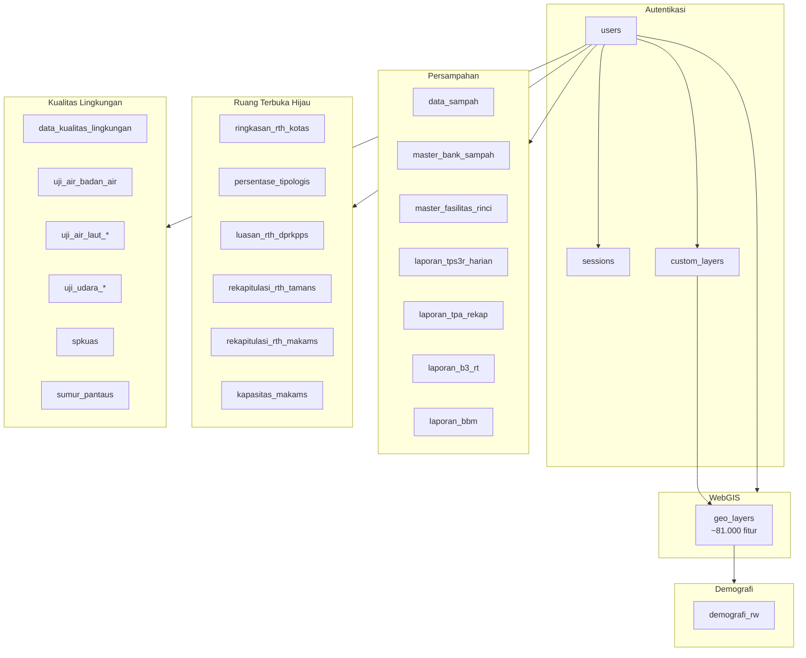

---

## 4.1 Analisis Sistem

### 4.1.1 Gambaran Umum Sistem

Berdasarkan struktur database `sidapeta_sby`, sistem yang dimodelkan merupakan **Sistem Informasi Geografis Daerah Pertanian/Perencanaan Tata Ruang Kota Surabaya (SIDAPETA)** — aplikasi WebGIS berbasis Laravel yang mengintegrasikan:

1. **Layer peta spasial** (`geo_layers`, `custom_layers`) berisi titik, garis, dan poligon dalam format GeoJSON.
2. **Data statistik dan pelaporan lingkungan hidup** (persampahan, RTH, kualitas air/udara, demografi).
3. **Manajemen pengguna** (`users`) untuk akses terautentikasi.

Database tidak memiliki tabel peran (role) terpisah; kontrol akses di level skema diasumsikan seragam untuk pengguna terdaftar, dengan satu akun administrator pada data seed (`admin@surabaya.go.id`).

### 4.1.2 Fungsi Utama Sistem

| Fungsi | Dukungan Database |
|--------|-------------------|
| Visualisasi peta interaktif | `geo_layers`, `custom_layers` |
| Unggah layer peta pengguna | `custom_layers` + relasi ke `users` |
| Statistik persampahan | `data_sampah`, `master_*`, `laporan_*` |
| Pemantauan RTH | `ringkasan_rth_kotas`, `luasan_rth_dprkpps`, `rekapitulasi_rth_*` |
| Pemantauan makam & krematorium | `kapasitas_makams`, `pegawai_krematoriums`, dll. |
| Kualitas lingkungan | `data_kualitas_lingkungan`, `uji_air_*`, `uji_udara_*` |
| Demografi RW | `demografi_rw` |
| Autentikasi & sesi | `users`, `sessions`, `password_reset_tokens` |

### 4.1.3 Aktor yang Terlibat

| Aktor | Keterangan |
|-------|------------|
| **Pengguna Terautentikasi** | Entitas pada tabel `users`; mengakses beranda, peta, CRUD data, dan statistik. |
| **Administrator** | Pengguna dengan hak mengelola data (di dump: `Administrator Surabaya`). |
| **Tamu (Guest)** | Mengakses halaman login/register sebelum autentikasi (tidak tersimpan sebagai tabel terpisah). |
| **DLH Surabaya** | Sumber data lingkungan (tercantum pada `sumber_data` / keterangan uji). |
| **DKRTH Surabaya** | Sumber data persampahan (`data_sampah.sumber_data`). |

*Tidak terdapat tabel role/permission di database; aktor peran dibedakan secara aplikatif, bukan pada skema SQL.*

### 4.1.4 Proses Bisnis Utama

1. **Autentikasi** — pengguna login, sistem membuat/menyimpan sesi di `sessions`.
2. **Eksplorasi peta** — sistem memuat fitur dari `geo_layers` per `layer_key`; pengguna dapat mengaktifkan layer (CCTV, TPS, makam, batas RW, dll.).
3. **Manajemen layer kustom** — pengguna mengunggah GeoJSON, metadata disimpan di `custom_layers`, fitur dapat direferensikan ke layer sistem.
4. **Pengelolaan data sampah** — CRUD pada `data_sampah`; pendukung: master bank sampah, laporan TPS3R/TPA/BBM/B3.
5. **Pengelolaan kualitas lingkungan** — CRUD pada `data_kualitas_lingkungan` dengan parameter uji dan status baku mutu.
6. **Pengelolaan RTH & sarpras** — modul RTH (`rth`, `rth-surabaya`) dan sarpras mengacu pada tabel RTH, makam, dan fasilitas.
7. **Pelaporan & ringkasan** — agregasi untuk dashboard (`ringkasan`, `data-statistik`) dari berbagai tabel rekap.

---

## 4.2 Use Case Diagram

### Identifikasi Aktor

1. Tamu (Guest)  
2. Pengguna Terdaftar (User)  
3. Administrator  

### Identifikasi Fitur (Use Case) — Sesuai Database & Rute Aplikasi

| UC | Nama Use Case | Tabel/Data Terkait |
|----|---------------|-------------------|
| UC01 | Login | `users`, `sessions` |
| UC02 | Register | `users` |
| UC03 | Reset Password | `password_reset_tokens` |
| UC04 | Lihat Beranda | — |
| UC05 | Lihat Peta (WebGIS) | `geo_layers` |
| UC06 | Kelola Layer Kustom | `custom_layers` |
| UC07 | Lihat Data Statistik | multi-tabel rekap |
| UC08 | CRUD Data Sampah | `data_sampah` |
| UC09 | CRUD Kualitas Lingkungan | `data_kualitas_lingkungan` |
| UC10 | CRUD Sarana Prasarana | `master_fasilitas_rinci`, `master_armada`, dll. |
| UC11 | CRUD Data RTH | `luasan_rth_dprkpps`, `rekapitulasi_rth_*`, dll. |
| UC12 | Lihat Ringkasan | `ringkasan_rth_kotas`, laporan |
| UC13 | Lihat RTH Surabaya | tabel RTH |
| UC14 | Kelola Profil | `users` |
| UC15 | Logout | `sessions` |

### Penjelasan Use Case (Ringkas)

- **UC01–UC03:** Mengelola identitas digital pengguna; satu-satunya relasi FK database menghubungkan `custom_layers` dengan `users`.
- **UC05–UC06:** Inti WebGIS; `geo_layers` menyimpan ±81.225 fitur dengan `layer_key` (mis. `CCTV_EKSISTING`, `TPS`, `MAKAM`, `KECAMATAN`).
- **UC08–UC11:** Operasi CRUD pada entitas tabular domain DKRTH/DLH.
- **UC07, UC12:** Read-only agregasi untuk dashboard chart.

### Diagram Use Case (Mermaid)

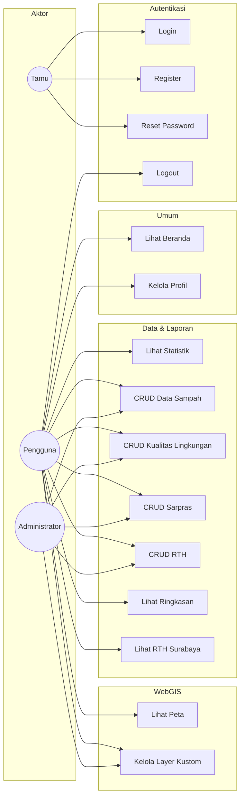

---

## 4.3 Activity Diagram

### 4.3.1 Activity Diagram — Login

**Penjelasan:** Pengguna memasukkan kredensial; sistem memvalidasi terhadap `users`, membuat record `sessions`, lalu mengarahkan ke beranda.

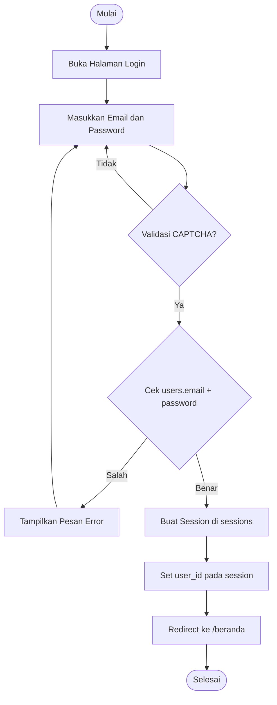

### 4.3.2 Activity Diagram — Tambah Data (Generik CRUD)

**Penjelasan:** Berlaku untuk entitas seperti `data_sampah`, `data_kualitas_lingkungan`, dan modul RTH/sarpras.

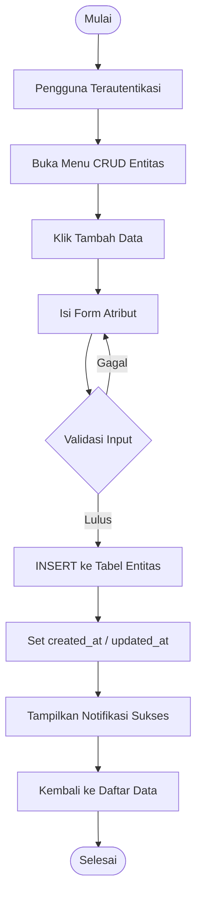

### 4.3.3 Activity Diagram — Edit Data

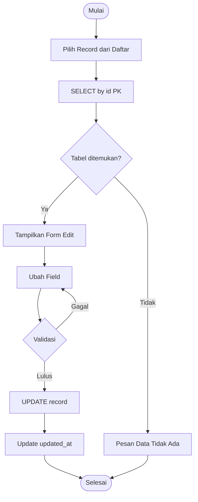

### 4.3.4 Activity Diagram — Hapus Data

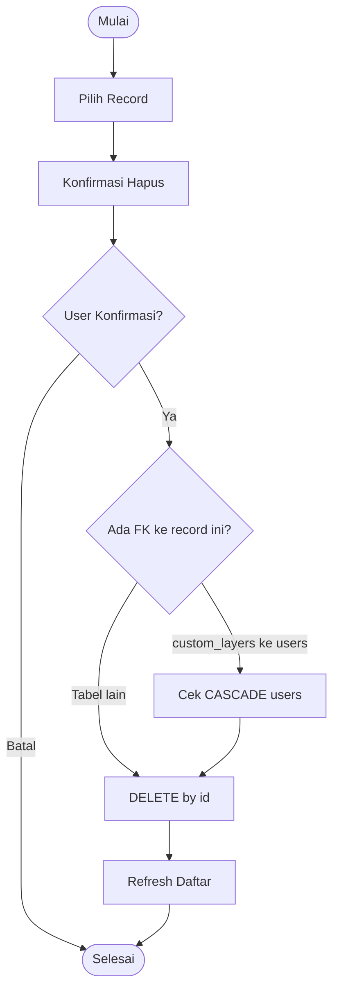

### 4.3.5 Activity Diagram — Proses Utama: Visualisasi Layer Peta

**Penjelasan:** Proses inti WebGIS — memuat layer dari `geo_layers` berdasarkan `layer_key`.

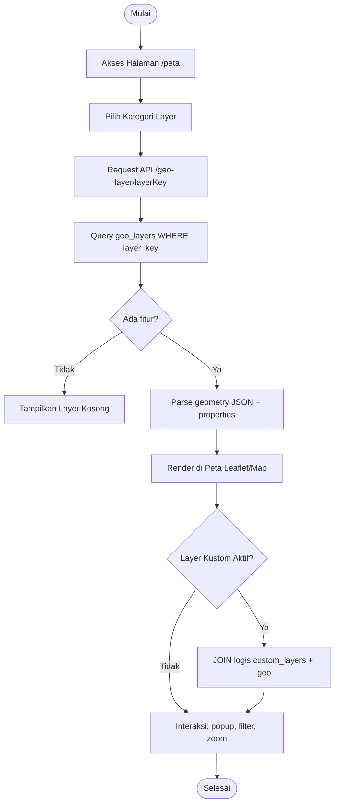

---

## 4.4 Sequence Diagram

### 4.4.1 Sequence Diagram — Login

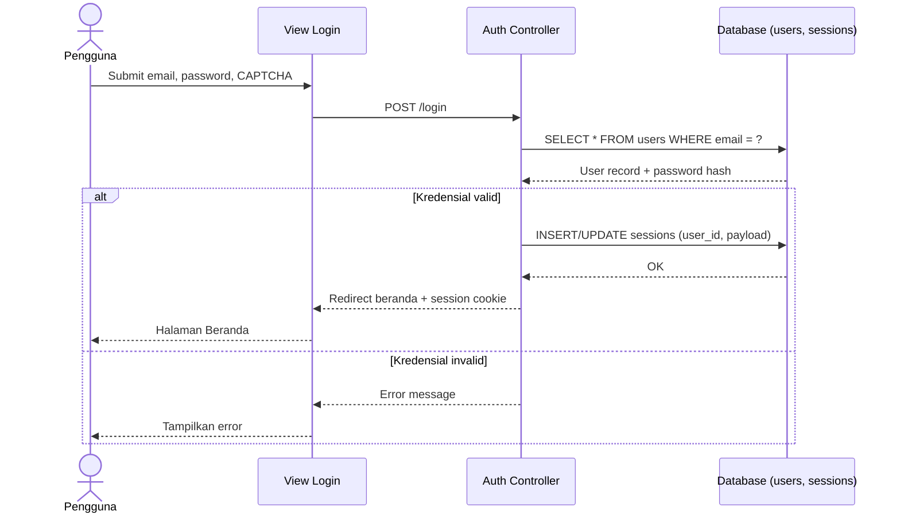

**Alur:** Pengguna → Controller autentikasi Laravel → validasi `users` → persistensi `sessions` → response redirect.

### 4.4.2 Sequence Diagram — CRUD Data Sampah (Contoh)

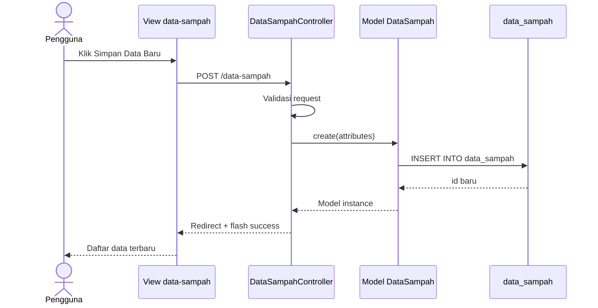

### 4.4.3 Sequence Diagram — Interaksi User dengan Database (Peta)

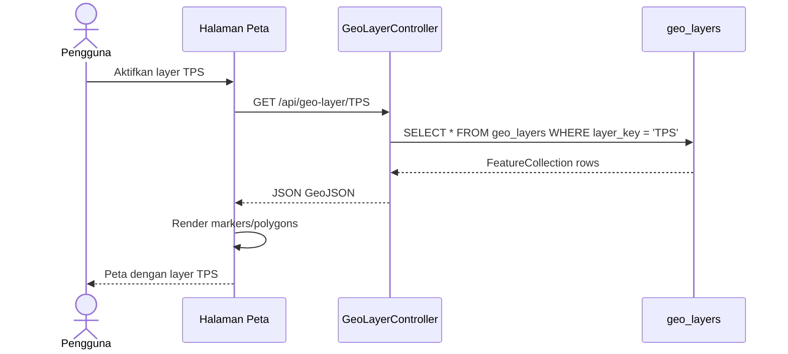

---

## 4.5 Class Diagram

**Penjelasan kardinalitas:**

| Simbol Mermaid | Arti |
|----------------|------|
| `"1" --> "1"` | One-to-One (1:1) |
| `"1" --> "0..1"` | One-to-Zero-or-One (1:0..1) |
| `"1" --> "*"` | One-to-Many (1:N) |
| `"*" --> "*"` | Many-to-Many (N:M) — hanya jika ada asosiasi semantik tanpa FK |
| `(FK)` | Foreign key resmi di SQL |
| `(logis)` | Relasi berdasarkan kolom/nama domain, tanpa FK |

**Catatan:** Database hanya memiliki **satu FK resmi** (`custom_layers.user_id`). Relasi lain bersifat logis atau agregasi data.

### Diagram Class — Relasi Lengkap

```mermaid
classDiagram
    direction TB

    %% ===== AUTENTIKASI =====
    class User {
        +bigint id
        +string name
        +string email
        +string password
        +timestamp email_verified_at
        +create()
        +read()
        +update()
        +delete()
    }
    class Session {
        +string id
        +bigint user_id
        +string ip_address
        +longtext payload
        +int last_activity
        +create()
        +read()
        +delete()
    }
    class PasswordResetToken {
        +string email
        +string token
        +timestamp created_at
        +create()
        +read()
        +delete()
    }

    %% ===== WEBGIS =====
    class CustomLayer {
        +bigint id
        +string layer_key
        +string name
        +string category
        +enum geometry_type
        +bigint user_id
        +int feature_count
        +create()
        +read()
        +update()
        +delete()
    }
    class GeoLayer {
        +bigint id
        +string layer_key
        +string name
        +string feature_id
        +json geometry
        +json properties
        +create()
        +read()
        +update()
        +delete()
    }

    %% ===== RTH =====
    class PersentaseTipologi {
        +bigint id
        +char tipologi
        +decimal persentase
        +read()
    }
    class LuasanRthDprkpp {
        +bigint id
        +char tipologi
        +string zona
        +decimal luas
        +create()
        +read()
        +update()
        +delete()
    }
    class RekapitulasiRthMakam {
        +bigint id
        +string nama_makam
        +decimal luas
        +read()
    }
    class KapasitasMakam {
        +bigint id
        +string nama_lokasi
        +decimal luas
        +string kapasitas_makam
        +create()
        +read()
        +update()
        +delete()
    }
    class RingkasanRthKota {
        +bigint id
        +string keterangan
        +decimal nilai
        +read()
    }

    %% ===== PERSAMPAHAN =====
    class MasterFasilitasRinci {
        +bigint id
        +string kode_fasilitas
        +string nama_fasilitas
        +string jenis_fasilitas
        +string kecamatan
        +create()
        +read()
        +update()
        +delete()
    }
    class LaporanTps3rHarian {
        +bigint id
        +string lokasi
        +date tanggal
        +double sampah_masuk_ton_hari
        +create()
        +read()
        +update()
        +delete()
    }
    class DataSampah {
        +bigint id
        +string kecamatan
        +string kelurahan
        +double volume_sampah_ton
        +int tahun
        +create()
        +read()
        +update()
        +delete()
    }
    class MasterBankSampah {
        +bigint id
        +string nama_bank_sampah
        +string wilayah
        +double tonase_kg_bulan
        +create()
        +read()
        +update()
        +delete()
    }

    %% ===== LINGKUNGAN =====
    class DataKualitasLingkungan {
        +bigint id
        +string lokasi
        +enum jenis_uji
        +string parameter_uji
        +enum status
        +create()
        +read()
        +update()
        +delete()
    }
    class DemografiRw {
        +bigint id
        +string kecamatan
        +string kelurahan
        +string rw
        +int jumlah_kk
        +int jumlah_jiwa
        +create()
        +read()
        +update()
        +delete()
    }

    %% --- 1 : N (FK resmi) ---
    User "1" --> "*" CustomLayer : memiliki (FK)

    %% --- 1 : N (logis, sessions.user_id) ---
    User "1" --> "*" Session : sesi aktif (logis)

    %% --- 1 : 0..1 (password_reset_tokens.email = users.email) ---
    User "1" --> "0..1" PasswordResetToken : token reset (logis)

    %% --- 1 : N (custom_layers.layer_key unik, banyak fitur geo_layers) ---
    CustomLayer "1" --> "*" GeoLayer : fitur per layer_key (logis)

    %% --- N : 0..1 (layer sistem tanpa baris custom_layers) ---
    GeoLayer "*" --> "0..1" CustomLayer : metadata layer (logis)

    %% --- 1 : N (tipologi A/B/C) ---
    PersentaseTipologi "1" --> "*" LuasanRthDprkpp : klasifikasi tipologi (logis)

    %% --- 1 : 0..1 (nama makam/lokasi setara) ---
    KapasitasMakam "1" --> "0..1" RekapitulasiRthMakam : rekap luas RTH (logis)

    %% --- 1 : N (nama/lokasi fasilitas) ---
    MasterFasilitasRinci "1" --> "*" LaporanTps3rHarian : laporan harian (logis)

    %% --- N : M (wilayah/kecamatan tanpa FK) ---
    MasterBankSampah "*" --> "*" DataSampah : agregat wilayah (logis, N:M)
```

### Diagram Class — Hanya Relasi dengan Kardinalitas (Ringkas)

```mermaid
classDiagram
    User "1" --> "*" CustomLayer : 1:N (FK)
    User "1" --> "*" Session : 1:N (logis)
    User "1" --> "0..1" PasswordResetToken : 1:0..1 (logis)
    CustomLayer "1" --> "*" GeoLayer : 1:N (logis)
    GeoLayer "*" --> "0..1" CustomLayer : N:0..1 (logis)
    PersentaseTipologi "1" --> "*" LuasanRthDprkpp : 1:N (logis)
    KapasitasMakam "1" --> "0..1" RekapitulasiRthMakam : 1:0..1 (logis)
    MasterFasilitasRinci "1" --> "*" LaporanTps3rHarian : 1:N (logis)
    MasterBankSampah "*" --> "*" DataSampah : N:M (logis)
```

### Tabel Kardinalitas Relasi

| Relasi | Kardinalitas | Tipe | Bukti di Database |
|--------|--------------|------|-------------------|
| User → CustomLayer | **1 : N** | FK | `custom_layers.user_id` → `users.id` |
| User → Session | **1 : N** | Logis | `sessions.user_id` (nullable, indexed) |
| User → PasswordResetToken | **1 : 0..1** | Logis | PK `email` pada kedua tabel |
| CustomLayer → GeoLayer | **1 : N** | Logis | `layer_key` unik di `custom_layers`, banyak baris di `geo_layers` |
| GeoLayer → CustomLayer | **N : 0..1** | Logis | Layer baku (CCTV, TPS, dll.) tanpa record `custom_layers` |
| PersentaseTipologi → LuasanRthDprkpp | **1 : N** | Logis | Kolom `tipologi` (A/B/C) |
| KapasitasMakam → RekapitulasiRthMakam | **1 : 0..1** | Logis | `nama_lokasi` ≈ `nama_makam` |
| MasterFasilitasRinci → LaporanTps3rHarian | **1 : N** | Logis | `nama_fasilitas` / `lokasi` |
| MasterBankSampah ↔ DataSampah | **N : M** | Logis | Kecocokan `wilayah`/`kecamatan` tanpa FK |
| DataKualitasLingkungan (per `lokasi`) | **1 : N** | Logis | Satu lokasi → banyak baris parameter (tanpa tabel induk terpisah) |
| DemografiRw, RingkasanRthKota, dll. | — | Mandiri | Tidak ada FK/logis kuat ke entitas lain |

---

## 4.6 ERD (Entity Relationship Diagram)

### Diagram ERD Utama (Mermaid ER)

```mermaid
erDiagram
    users ||--o{ custom_layers : "user_id FK CASCADE"
    users ||--o{ sessions : "user_id logis"
    persentase_tipologis ||--o{ luasan_rth_dprkpps : "tipologi"
    geo_layers }o--o| custom_layers : "layer_key logis"
    users {
        bigint id PK
        varchar name
        varchar email UK
        varchar password
    }
    custom_layers {
        bigint id PK
        varchar layer_key UK
        bigint user_id FK
        varchar name
        enum geometry_type
    }
    geo_layers {
        bigint id PK
        varchar layer_key
        longtext geometry
        longtext properties
    }
    sessions {
        varchar id PK
        bigint user_id
        longtext payload
    }
    data_sampah {
        bigint id PK
        varchar kecamatan
        varchar kelurahan
        double volume_sampah_ton
        int tahun
    }
    data_kualitas_lingkungan {
        bigint id PK
        varchar lokasi
        enum jenis_uji
        varchar parameter_uji
        enum status
    }
    demografi_rw {
        bigint id PK
        varchar kecamatan
        varchar kelurahan
        varchar rw UK
        int jumlah_kk
    }
    master_bank_sampah {
        bigint id PK
        varchar nama_bank_sampah
        varchar wilayah
    }
    master_fasilitas_rinci {
        bigint id PK
        varchar kode_fasilitas
        varchar jenis_fasilitas
    }
    laporan_tps3r_harian {
        bigint id PK
        varchar lokasi
        date tanggal
    }
    ringkasan_rth_kotas {
        bigint id PK
        varchar keterangan
        decimal nilai
    }
    persentase_tipologis {
        bigint id PK
        char tipologi UK
        decimal persentase
    }
    luasan_rth_dprkpps {
        bigint id PK
        char tipologi
        varchar zona
    }
    kapasitas_makams {
        bigint id PK
        varchar nama_lokasi
    }
```

### Keterangan Kardinalitas

| Relasi | Kardinalitas | Keterangan |
|--------|--------------|------------|
| users → custom_layers | 1 : N | Satu-satunya FK resmi di dump SQL |
| users → sessions | 1 : N | `sessions.user_id` nullable, index |
| persentase_tipologis → luasan_rth_dprkpps | 1 : N | Matching `tipologi` (A/B/C) |
| geo_layers ↔ custom_layers | N : M (logis) | Berbagi konsep `layer_key`, tanpa FK |

### Layer Key pada `geo_layers` (Referensi Spasial)

Layer baku yang diimpor meliputi antara lain: `CCTV_EKSISTING`, `CCTV_RENCANA`, `TPS`, `TPS3R`, `MAKAM`, `DAMKAR`, `KECAMATAN`, `KELURAHAN`, `BATAS_RW`, `KEPADATAN_PENDUDUK`, `RUTE_SAMPAH`, `PAUD`, `SD_MI`, `SMP_MTS`, dan infrastruktur air (`TITIK_POMPA_AIR`, `SALURAN_AIR`, dll.).

---

## LAMPIRAN: INDEKS PENTING

| Tabel | Indeks Unik / Khusus |
|-------|----------------------|
| `users` | UNIQUE `email` |
| `custom_layers` | UNIQUE `layer_key`, INDEX `user_id` |
| `demografi_rw` | UNIQUE (`kecamatan`,`kelurahan`,`rw`) |
| `persentase_tipologis` | UNIQUE `tipologi` |
| `geo_layers` | INDEX (`layer_key`,`name`), INDEX `layer_key` |
| `failed_jobs` | UNIQUE `uuid` |

---

*Dokumen ini disusun berdasarkan analisis langsung terhadap file `sidapeta_sby (1).sql` tanpa menambahkan entitas atau fitur yang tidak tercermin dalam skema database.*
