# DOKUMEN DIAGRAM SISTEM — SIDAPETA SURABAYA

**Sumber:** Database `sidapeta_sby` (`sidapeta_sby (1).sql`) + modul aplikasi WebGIS Bappeda Surabaya  
**Format:** Bahasa Indonesia formal — siap dimasukkan ke laporan/skripsi  
**Catatan:** Semua diagram diselaraskan dengan tabel dan fitur yang benar-benar ada di sistem.

---

## DAFTAR ISI

1. [Use Case Diagram & Use Case Scenario](#1-use-case-diagram--use-case-scenario)
2. [Diagram Proses Bisnis](#2-diagram-proses-bisnis)
3. [Activity Diagram](#3-activity-diagram)
4. [Class Diagram](#4-class-diagram)
5. [Sequence Diagram](#5-sequence-diagram)
6. [ERD (Entity Relationship Diagram)](#6-erd-entity-relationship-diagram)

---

## 1. Use Case Diagram & Use Case Scenario

### 1.1 Identifikasi Aktor

| Aktor | Deskripsi |
|-------|-----------|
| **Tamu (Guest)** | Pengunjung belum login; hanya mengakses login, register, reset password, CAPTCHA |
| **Pengguna Terdaftar (User)** | Pengguna autentikasi pada tabel `users`; mengakses beranda, peta, statistik, CRUD data |
| **Administrator** | Pengguna dengan kewenangan penuh mengelola data dan layer (di dump: akun `Administrator Surabaya`) |

*Tidak ada tabel `roles` di database; pembagian Administrator bersifat konvensional aplikasi.*

### 1.2 Daftar Use Case

| ID | Use Case | Aktor | Tabel / Modul Terkait |
|----|----------|-------|------------------------|
| UC-01 | Login | Tamu, User | `users`, `sessions` |
| UC-02 | Register | Tamu | `users` |
| UC-03 | Reset Password | Tamu | `password_reset_tokens`, `users` |
| UC-04 | Logout | User | `sessions` |
| UC-05 | Lihat Beranda | User | — |
| UC-06 | Lihat Peta Interaktif | User | `geo_layers` |
| UC-07 | Cari Fitur di Peta | User | `geo_layers` (API search) |
| UC-08 | Kelola Layer Kustom | User, Admin | `custom_layers`, `users` |
| UC-09 | Lihat Data Statistik | User | `kompos_lokasi`, `kebutuhan_bbm_*`, `master_*`, dll. |
| UC-10 | Lihat RTH Surabaya | User | `ringkasan_rth_kotas`, `luasan_rth_dprkpps`, dll. |
| UC-11 | CRUD Data Sampah | User, Admin | `data_sampah` |
| UC-12 | CRUD Kualitas Lingkungan | User, Admin | `data_kualitas_lingkungan` |
| UC-13 | CRUD Sarana Prasarana | User, Admin | `kebutuhan_bbm_*`, `master_armada`, `master_fasilitas_rinci` |
| UC-14 | CRUD Data RTH | User, Admin | `luasan_rth_dprkpps`, `rekapitulasi_rth_*` |
| UC-15 | Lihat Ringkasan Dashboard | User | `data_sampah`, `data_kualitas_lingkungan`, dll. |
| UC-16 | Kelola Profil Akun | User | `users` |

### 1.3 Use Case Diagram

```mermaid
flowchart TB
    subgraph system["Sistem SIDAPETA Surabaya"]
        UC01([UC-01 Login])
        UC02([UC-02 Register])
        UC03([UC-03 Reset Password])
        UC04([UC-04 Logout])
        UC05([UC-05 Lihat Beranda])
        UC06([UC-06 Lihat Peta])
        UC07([UC-07 Cari Fitur Peta])
        UC08([UC-08 Kelola Layer Kustom])
        UC09([UC-09 Data Statistik])
        UC10([UC-10 RTH Surabaya])
        UC11([UC-11 CRUD Data Sampah])
        UC12([UC-12 CRUD Kualitas Lingkungan])
        UC13([UC-13 CRUD Sarpras])
        UC14([UC-14 CRUD RTH])
        UC15([UC-15 Ringkasan])
        UC16([UC-16 Profil])
    end

    Guest((Tamu))
    User((Pengguna))
    Admin((Administrator))

    Guest --> UC01
    Guest --> UC02
    Guest --> UC03
    User --> UC04
    User --> UC05
    User --> UC06
    User --> UC07
    User --> UC08
    User --> UC09
    User --> UC10
    User --> UC11
    User --> UC12
    User --> UC13
    User --> UC14
    User --> UC15
    User --> UC16
    Admin --> UC08
    Admin --> UC11
    Admin --> UC12
    Admin --> UC13
    Admin --> UC14
```

### 1.4 Use Case Scenario

#### UC-01 — Login

| Item | Keterangan |
|------|------------|
| **Use Case ID** | UC-01 |
| **Nama** | Login |
| **Aktor utama** | Tamu / Pengguna |
| **Precondition** | Pengguna belum terautentikasi; akun terdaftar di `users` |
| **Postcondition** | Sesi aktif tersimpan di `sessions`; pengguna diarahkan ke `/beranda` |
| **Alur utama** | 1. Pengguna membuka halaman login<br>2. Pengguna memasukkan email, password, dan CAPTCHA<br>3. Sistem memvalidasi kredensial terhadap `users`<br>4. Sistem membuat record `sessions` dengan `user_id`<br>5. Sistem menampilkan halaman beranda |
| **Alur alternatif** | 3a. Kredensial salah → sistem menampilkan pesan error, kembali ke langkah 2 |
| **Alur eksepsi** | Database tidak dapat diakses → tampilkan halaman error sistem |

#### UC-06 — Lihat Peta Interaktif

| Item | Keterangan |
|------|------------|
| **Use Case ID** | UC-06 |
| **Nama** | Lihat Peta Interaktif |
| **Aktor utama** | Pengguna Terdaftar |
| **Precondition** | Pengguna sudah login |
| **Postcondition** | Layer peta ditampilkan berdasarkan data `geo_layers` |
| **Alur utama** | 1. Pengguna membuka menu Peta (`/peta`)<br>2. Pengguna memilih kategori/layer (mis. TPS, CCTV, MAKAM)<br>3. Sistem memanggil API `GET /api/geo-layer/{layerKey}`<br>4. Sistem mengambil fitur dari `geo_layers` WHERE `layer_key`<br>5. Sistem merender geometri GeoJSON di peta |
| **Alur alternatif** | 4a. Layer kosong → tampilkan peta tanpa fitur layer tersebut |
| **Tabel terkait** | `geo_layers`, opsional `custom_layers` |

#### UC-08 — Kelola Layer Kustom

| Item | Keterangan |
|------|------------|
| **Use Case ID** | UC-08 |
| **Nama** | Kelola Layer Kustom |
| **Aktor utama** | Pengguna / Administrator |
| **Precondition** | Login; file GeoJSON valid |
| **Postcondition** | Metadata tersimpan di `custom_layers` dengan `user_id` |
| **Alur utama** | 1. Pengguna unggah file GeoJSON<br>2. Sistem menghasilkan `layer_key` unik<br>3. Sistem INSERT ke `custom_layers` (nama, kategori, geometry_type, user_id)<br>4. Fitur spasial dapat diimpor/ditampilkan terkait `layer_key`<br>5. Layer muncul di daftar layer peta |
| **Alur alternatif** | 2a. `layer_key` duplikat → tolak (UNIQUE constraint) |
| **Relasi DB** | `custom_layers.user_id` → `users.id` (FK, ON DELETE CASCADE) |

#### UC-11 — CRUD Data Sampah

| Item | Keterangan |
|------|------------|
| **Use Case ID** | UC-11 |
| **Nama** | Kelola Data Sampah (Create / Read / Update / Delete) |
| **Aktor utama** | Pengguna / Administrator |
| **Precondition** | Login |
| **Postcondition** | Record `data_sampah` berubah sesuai operasi |
| **Alur utama (Tambah)** | 1. Buka `/data-sampah/create`<br>2. Isi kecamatan, kelurahan, volume, tahun, dll.<br>3. Validasi form<br>4. INSERT ke `data_sampah`<br>5. Redirect ke daftar dengan notifikasi sukses |
| **Alur utama (Ubah)** | 1. Pilih record → edit<br>2. UPDATE `data_sampah` WHERE `id`<br>3. Tampilkan data terbaru |
| **Alur utama (Hapus)** | 1. Konfirmasi hapus<br>2. DELETE FROM `data_sampah` WHERE `id` |
| **Tabel terkait** | `data_sampah`; pendukung statistik: `master_bank_sampah`, `laporan_tps3r_harian` |

#### UC-12 — CRUD Kualitas Lingkungan

| Item | Keterangan |
|------|------------|
| **Use Case ID** | UC-12 |
| **Nama** | Kelola Data Kualitas Lingkungan |
| **Aktor utama** | Pengguna / Administrator |
| **Precondition** | Login |
| **Postcondition** | Data uji tersimpan/terupdate di `data_kualitas_lingkungan` |
| **Alur utama** | 1. Buka modul kualitas lingkungan<br>2. Input lokasi, jenis_uji, parameter_uji, nilai_hasil, baku_mutu, status<br>3. Sistem bandingkan nilai dengan baku mutu → set status (memenuhi / tidak_memenuhi / belum_diuji)<br>4. Simpan ke database |
| **Tabel terkait** | `data_kualitas_lingkungan`; referensi lokasi uji: `uji_air_*`, `uji_udara_*` |

---

## 2. Diagram Proses Bisnis

### 2.1 Proses Bisnis Utama — Operasional Sistem

Proses bisnis macro yang didukung database SIDAPETA: **pengelolaan data spasial**, **pelaporan lingkungan**, dan **pengambilan keputusan berbasis peta**.

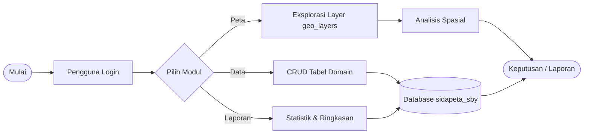

### 2.2 Proses Bisnis — Pengelolaan Persampahan

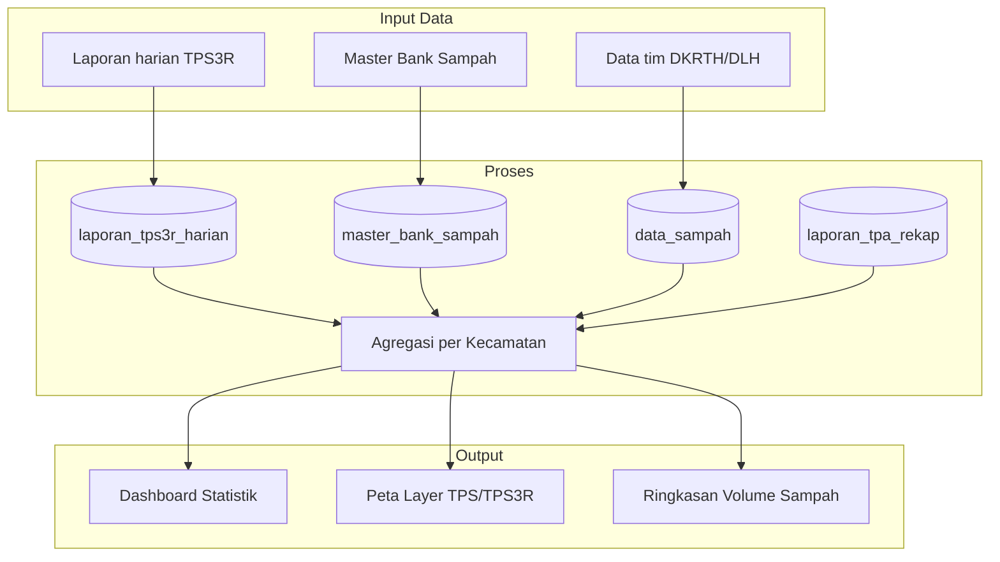

### 2.3 Proses Bisnis — Pemantauan Ruang Terbuka Hijau (RTH)

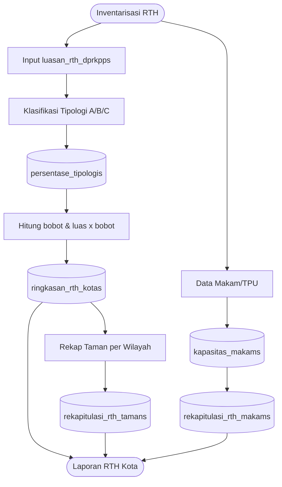

### 2.4 Proses Bisnis — Pemantauan Kualitas Lingkungan

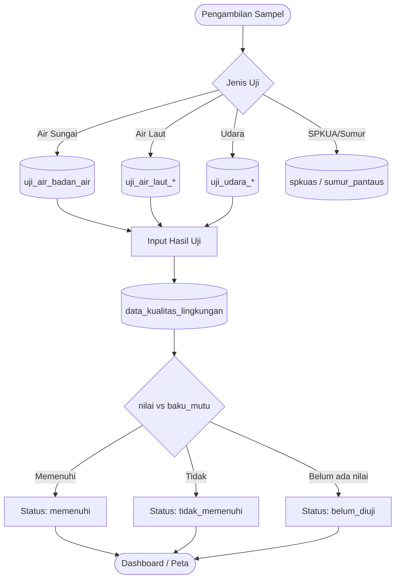

---

## 3. Activity Diagram

### 3.1 Activity Diagram — Autentikasi (Login)

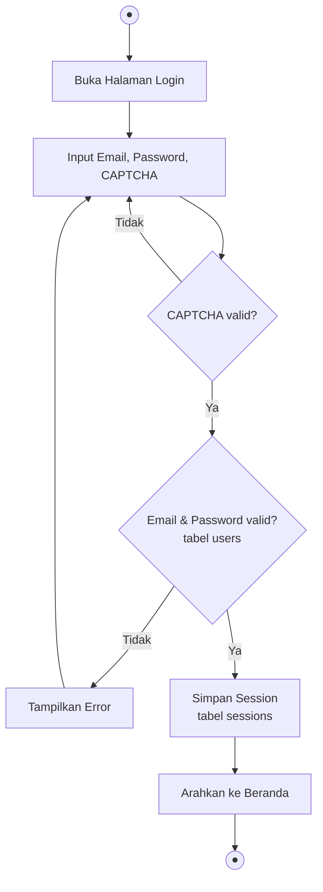

### 3.2 Activity Diagram — Tambah Data (Generik CRUD)

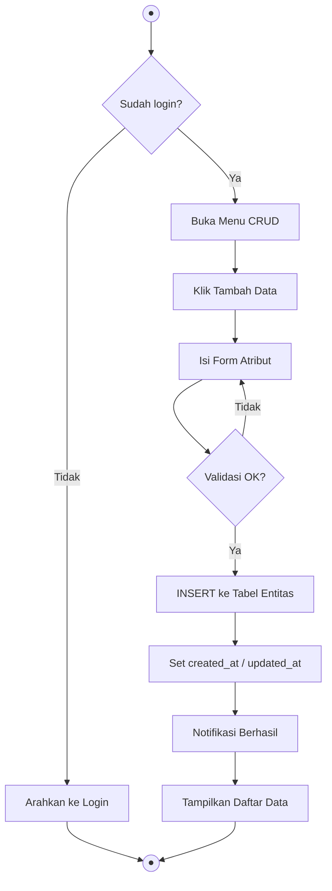

### 3.3 Activity Diagram — Edit & Hapus Data

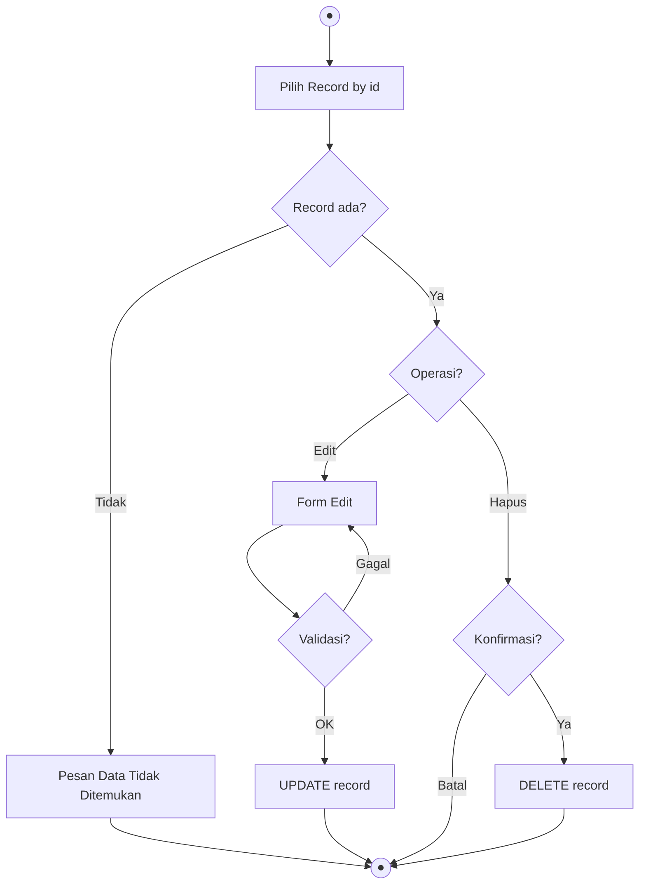

### 3.4 Activity Diagram — Visualisasi Layer Peta (Proses Inti WebGIS)

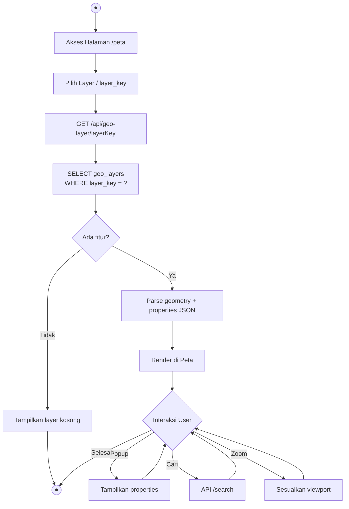

### 3.5 Activity Diagram — Unggah Layer Kustom

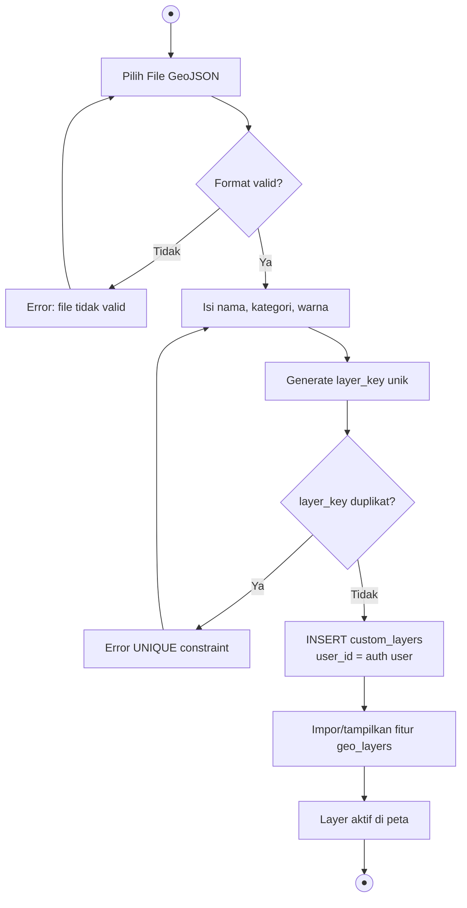

---

## 4. Class Diagram

### 4.1 Diagram Lengkap (Atribut + Relasi + Kardinalitas)

```mermaid
classDiagram
    direction TB

    class User {
        +bigint id
        +string name
        +string email
        +string password
        +create()
        +read()
        +update()
        +delete()
    }
    class Session {
        +string id
        +bigint user_id
        +longtext payload
        +create()
        +read()
        +delete()
    }
    class PasswordResetToken {
        +string email
        +string token
        +create()
        +delete()
    }
    class CustomLayer {
        +bigint id
        +string layer_key
        +string name
        +bigint user_id
        +create()
        +read()
        +update()
        +delete()
    }
    class GeoLayer {
        +bigint id
        +string layer_key
        +json geometry
        +json properties
        +create()
        +read()
        +update()
        +delete()
    }
    class DataSampah {
        +bigint id
        +string kecamatan
        +string kelurahan
        +double volume_sampah_ton
        +int tahun
        +create()
        +read()
        +update()
        +delete()
    }
    class DataKualitasLingkungan {
        +bigint id
        +string lokasi
        +enum jenis_uji
        +string parameter_uji
        +enum status
        +create()
        +read()
        +update()
        +delete()
    }
    class PersentaseTipologi {
        +bigint id
        +char tipologi
        +decimal persentase
        +read()
    }
    class LuasanRthDprkpp {
        +bigint id
        +char tipologi
        +string zona
        +decimal luas
        +create()
        +read()
        +update()
        +delete()
    }
    class KapasitasMakam {
        +bigint id
        +string nama_lokasi
        +create()
        +read()
        +update()
        +delete()
    }
    class RekapitulasiRthMakam {
        +bigint id
        +string nama_makam
        +decimal luas
        +read()
    }
    class MasterFasilitasRinci {
        +bigint id
        +string nama_fasilitas
        +string jenis_fasilitas
        +create()
        +read()
        +update()
        +delete()
    }
    class LaporanTps3rHarian {
        +bigint id
        +string lokasi
        +date tanggal
        +create()
        +read()
        +update()
        +delete()
    }
    class MasterBankSampah {
        +bigint id
        +string nama_bank_sampah
        +string wilayah
        +create()
        +read()
        +update()
        +delete()
    }
    class DemografiRw {
        +bigint id
        +string kecamatan
        +string kelurahan
        +string rw
        +int jumlah_kk
        +create()
        +read()
        +update()
        +delete()
    }

    User "1" --> "*" CustomLayer : 1:N FK
    User "1" --> "*" Session : 1:N logis
    User "1" --> "0..1" PasswordResetToken : 1:0..1 logis
    CustomLayer "1" --> "*" GeoLayer : 1:N logis
    GeoLayer "*" --> "0..1" CustomLayer : N:0..1 logis
    PersentaseTipologi "1" --> "*" LuasanRthDprkpp : 1:N logis
    KapasitasMakam "1" --> "0..1" RekapitulasiRthMakam : 1:0..1 logis
    MasterFasilitasRinci "1" --> "*" La poranTps3rHarian : 1:N logis
    MasterBankSampah "*" --> "*" DataSampah : N:M logis
```

### 4.2 Legenda Kardinalitas

| Notasi | Arti |
|--------|------|
| `1` → `1` | One-to-One |
| `1` → `0..1` | One-to-Optional-One |
| `1` → `*` | One-to-Many |
| `*` → `0..1` | Many-to-Optional-One |
| `*` → `*` | Many-to-Many |

---

## 5. Sequence Diagram

### 5.1 Sequence Diagram — Login

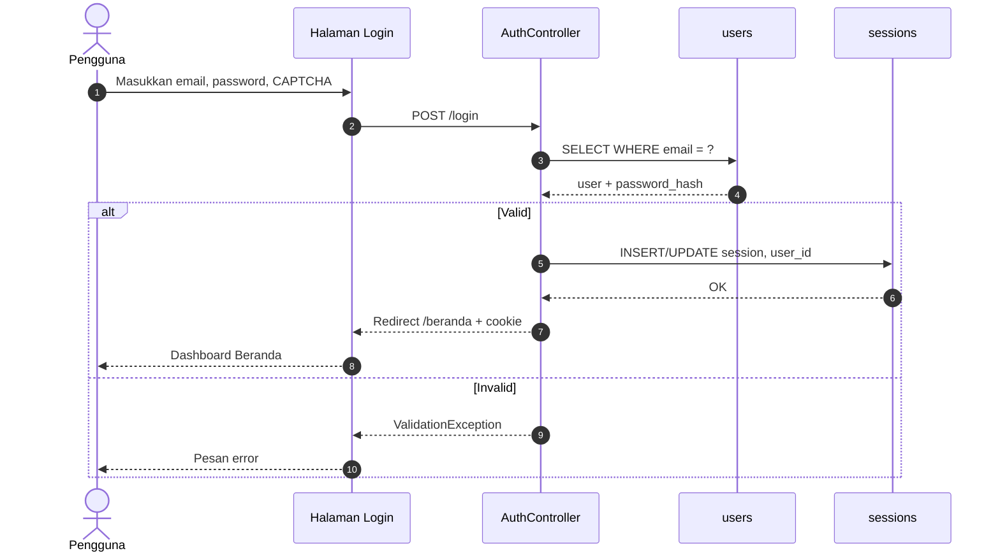

### 5.2 Sequence Diagram — CRUD Data Sampah

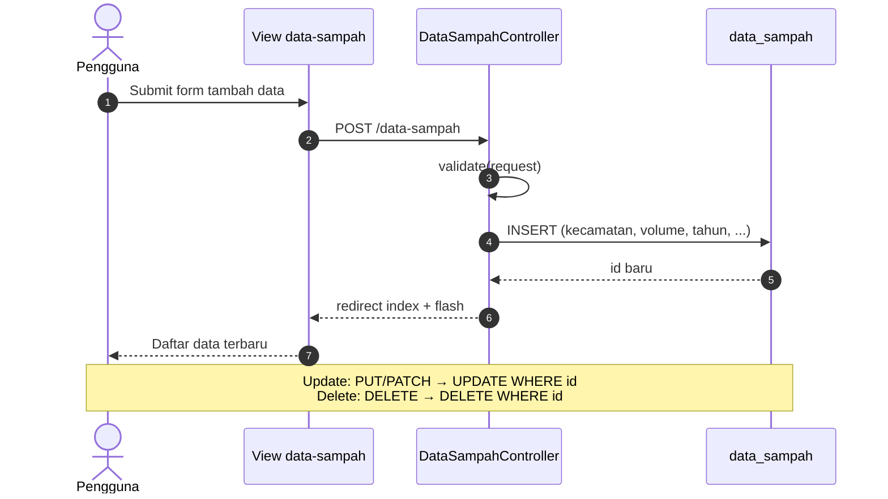

### 5.3 Sequence Diagram — Load Layer Peta

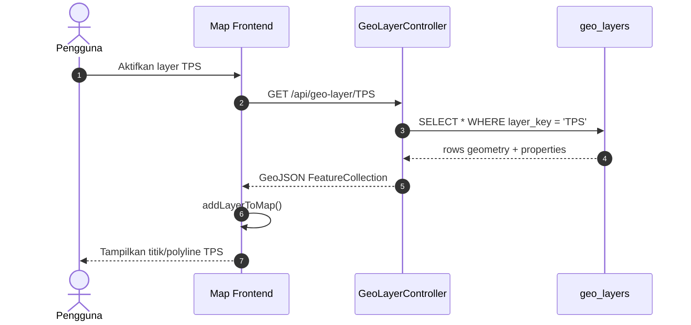

### 5.4 Sequence Diagram — Unggah Layer Kustom

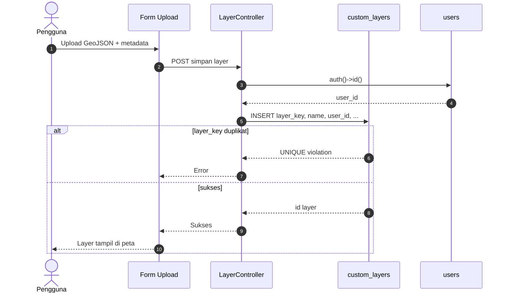

### 5.5 Sequence Diagram — Lihat Ringkasan Dashboard

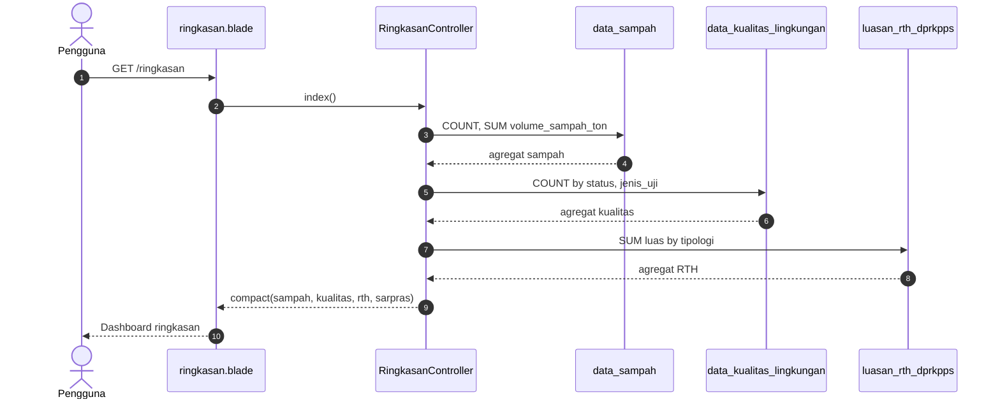

---

## 6. ERD (Entity Relationship Diagram)

### 6.1 ERD Domain Utama (Relasi Lengkap)

```mermaid
erDiagram
    users ||--o{ custom_layers : "user_id FK CASCADE"
    users ||--o{ sessions : "user_id indexed"
    users ||--o| password_reset_tokens : "email"

    custom_layers ||--o{ geo_layers : "layer_key logis"
    persentase_tipologis ||--o{ luasan_rth_dprkpps : "tipologi"
    kapasitas_makams ||--o| rekapitulasi_rth_makams : "nama lokasi logis"
    master_fasilitas_rinci ||--o{ laporan_tps3r_harian : "lokasi logis"

    users {
        bigint id PK
        varchar name
        varchar email UK
        varchar password
        timestamp email_verified_at
    }

    sessions {
        varchar id PK
        bigint user_id FK_logis
        longtext payload
        int last_activity
    }

    password_reset_tokens {
        varchar email PK
        varchar token
        timestamp created_at
    }

    custom_layers {
        bigint id PK
        varchar layer_key UK
        bigint user_id FK
        varchar name
        varchar category
        enum geometry_type
        bigint user_id FK
    }

    geo_layers {
        bigint id PK
        varchar layer_key
        varchar feature_id
        longtext geometry
        longtext properties
    }

    demografi_rw {
        bigint id PK
        varchar kecamatan
        varchar kelurahan
        varchar rw
        int jumlah_kk
        int jumlah_jiwa
    }

    data_sampah {
        bigint id PK
        varchar kecamatan
        varchar kelurahan
        double volume_sampah_ton
        double sampah_terangkut_ton
        int tahun
    }

    data_kualitas_lingkungan {
        bigint id PK
        varchar lokasi
        enum jenis_uji
        varchar parameter_uji
        double nilai_hasil
        double baku_mutu
        enum status
    }

    master_bank_sampah {
        bigint id PK
        varchar nama_bank_sampah
        varchar wilayah
        double tonase_kg_bulan
    }

    master_fasilitas_rinci {
        bigint id PK
        varchar kode_fasilitas
        varchar nama_fasilitas
        varchar jenis_fasilitas
        varchar kecamatan
    }

    master_armada {
        bigint id PK
        varchar jenis_kendaraan
        int jumlah_unit
    }

    laporan_tps3r_harian {
        bigint id PK
        varchar lokasi
        date tanggal
        double sampah_masuk_ton_hari
    }

    laporan_tpa_rekap {
        bigint id PK
        int tahun
        double total_tonase
    }

    laporan_bbm {
        bigint id PK
        int bulan_ke
        varchar nama_bulan
        double solar_liter
    }

    laporan_b3_rt {
        bigint id PK
        varchar nama_lokasi
        int tahun
        double berat_kg
    }

    kompos_lokasi {
        bigint no PK
        varchar lokasi
        decimal bahan_masuk_2025
    }

    ringkasan_rth_kotas {
        bigint id PK
        varchar keterangan
        decimal nilai
    }

    persentase_tipologis {
        bigint id PK
        char tipologi UK
        decimal persentase
    }

    luasan_rth_dprkpps {
        bigint id PK
        char tipologi
        varchar zona
        decimal luas
    }

    rekapitulasi_rth_tamans {
        bigint id PK
        varchar wilayah
        int jumlah_taman_aktif
        decimal luas_taman_aktif
    }

    rekapitulasi_rth_makams {
        bigint id PK
        varchar nama_makam
        decimal luas
    }

    kapasitas_makams {
        bigint id PK
        varchar nama_lokasi
        decimal luas
        varchar kapasitas_makam
    }

    pegawai_krematoriums {
        bigint id PK
        int no
        varchar nama_pegawai
        varchar lokasi_kerja
    }

    uji_air_badan_air {
        bigint id PK
        varchar nama_sungai
        varchar koordinat
    }

    uji_udara_ambien_particulate_counters {
        bigint id PK
        varchar lokasi
        varchar peruntukan_kawasan
    }

    spkuas {
        bigint id PK
        varchar nama_spkua
    }

    sumur_pantaus {
        bigint id PK
        varchar nama_sumur
    }
```

### 6.2 ERD per Domain (Persampahan)

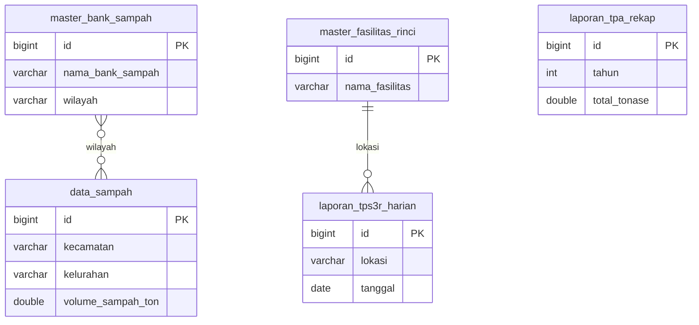

### 6.3 ERD per Domain (WebGIS & Autentikasi)

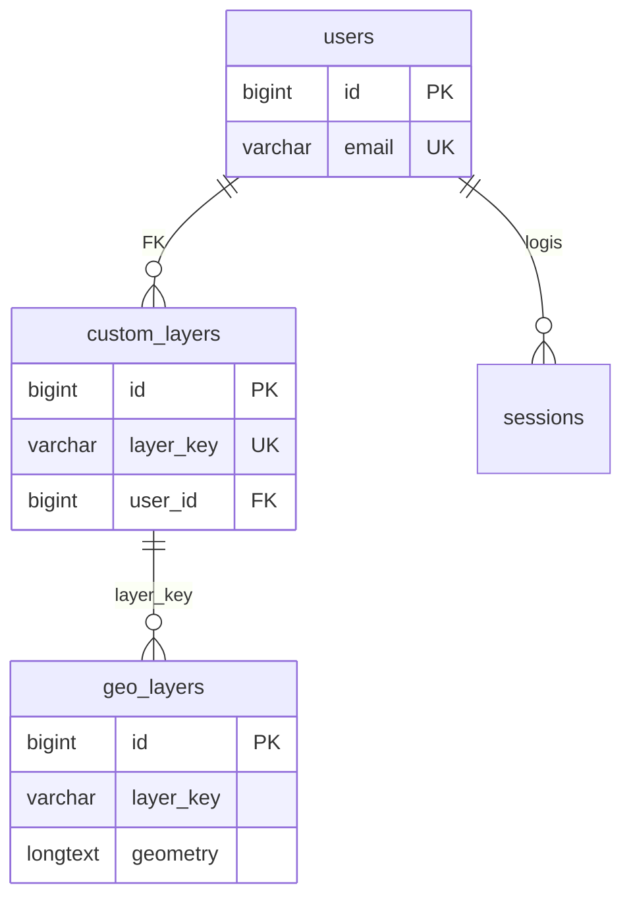

### 6.4 Tabel Kardinalitas ERD

| Relasi | PK | FK | Kardinalitas |
|--------|----|----|--------------|
| users → custom_layers | users.id | custom_layers.user_id | 1 : N |
| users → sessions | users.id | sessions.user_id | 1 : N |
| persentase_tipologis → luasan_rth_dprkpps | tipologi | tipologi | 1 : N |
| custom_layers → geo_layers | layer_key | layer_key | 1 : N |
| master_fasilitas_rinci → laporan_tps3r_harian | — | lokasi (logis) | 1 : N |

---

## LAMPIRAN — Cara Render Diagram

1. **VS Code / Cursor:** instal ekstensi *Markdown Preview Mermaid Support*, buka preview Markdown.
2. **Mermaid Live Editor:** https://mermaid.live — tempel blok kode, export PNG/SVG.
3. **Word:** export gambar dari Mermaid Live, sisipkan ke dokumen.

---

*Dokumen ini melengkapi `ANALISIS_SISTEM_SIDAPETA_SBY.md` dan seluruh diagram disinkronkan dengan file `sidapeta_sby (1).sql`.*
